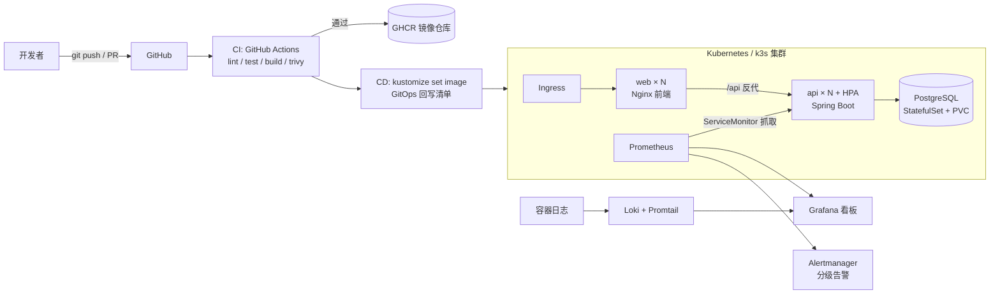

# TaskFlow · 云原生 DevOps 端到端实践平台

一个从代码提交到生产发布全链路自动化的 DevOps 综合项目：**示例微服务应用 + CI/CD 流水线 + Kubernetes 编排 + 可观测性 + IaC**，覆盖 DevOps 工程师的完整技能地图。


## 架构总览



**一条完整链路**：开发者提交代码 → CI 自动完成代码检查、单元测试、镜像构建与安全扫描 → 合入 main 后自动推送镜像并回写生产清单（GitOps）→ 集群滚动更新（零停机）→ Prometheus 实时抓取指标 → Grafana 展示 → 异常触发分级告警 → 按 Runbook 处置。

## 核心特性

| 领域 | 技术与实现 |
|------|-----------|
| 应用 | Spring Boot 3 / Java 21（CRUD/健康检查/Actuator 指标/OpenAPI 文档）、Nginx 静态前端、PostgreSQL |
| 容器化 | 多阶段构建、非 root 运行、HEALTHCHECK、Maven 依赖缓存加速 |
| CI | GitHub Actions：yamllint、hadolint、kubeconform、helm lint、terraform validate、Maven 测试（JaCoCo 覆盖率门禁） |
| 安全 | Trivy 镜像漏洞扫描门禁、K8s securityContext 最小权限、Dependabot 依赖升级 |
| CD | main 合入自动推送 GHCR（sha+latest 标签）、GitOps 回写 overlay、可选 kubectl 部署；另附 Jenkinsfile |
| 编排 | Kustomize base/overlays 多环境、Helm Chart 双方案、HPA 自动扩缩容、探针、滚动更新 |
| 可观测 | Prometheus 指标 + 8 条告警规则、Alertmanager 分级路由、Grafana 看板即代码、Loki 日志 |
| IaC | Terraform 一键创建阿里云 ECS（开机自带 k3s）、Ansible 裸机装 k3s 并部署应用 |

## 快速开始

### 方式一：本地跑通应用（最轻量，无需 Docker）

```bash
cd app/api
./mvnw spring-boot:run       # Windows PowerShell: .\mvnw.cmd spring-boot:run
# 应用默认使用 H2 内存库，开箱即用
# 打开 http://127.0.0.1:8000/swagger-ui.html 查看接口文档
```

跑测试与覆盖率门禁：

```bash
cd app/api
./mvnw verify                # JUnit 5 测试 + JaCoCo 行覆盖率 ≥ 80% 门禁
```

### 方式二：Docker Compose 一键全栈（推荐演示）

```bash
cp .env.example .env
docker compose up -d --build
```

启动后访问：

| 服务 | 地址 | 说明 |
|------|------|------|
| 应用看板 | http://127.0.0.1:8080 | Nginx 前端 → 反代 API |
| API 文档 | http://127.0.0.1:8000/swagger-ui.html | springdoc OpenAPI 3 |
| Prometheus | http://127.0.0.1:9090 | 指标与告警规则 |
| Grafana | http://127.0.0.1:3000 | admin / .env 中密码，内置「TaskFlow 应用监控」看板 |
| Alertmanager | http://127.0.0.1:9093 | 告警路由状态 |

验证：`bash scripts/smoke-test.sh`，压测：`python scripts/load_test.py --url http://127.0.0.1:8080/api/tasks --duration 30`

### 方式三：Kubernetes 部署

```bash
# 1. 替换镜像仓库（推送到 GHCR 后 CD 也会自动写入）
kustomize edit set image ghcr.io/example/taskflow-api=ghcr.io/<你的用户名>/taskflow-api --load-restrictor=none

# 2. 任选其一部署
kubectl apply -k k8s/overlays/dev      # 开发环境（单副本，taskflow-dev 命名空间）
kubectl apply -k k8s/overlays/prod     # 生产环境（2 副本 + HPA）
helm install taskflow ./helm/taskflow -n taskflow --create-namespace   # 或 Helm
```

### 方式四：云上资源（可选）

```bash
cd terraform && cp terraform.tfvars.example terraform.tfvars
terraform init && terraform apply     # 自动创建阿里云 ECS，开机即装好 k3s
cd ../ansible
cp inventory.ini.example inventory.ini  # 填入输出的公网 IP
ansible-playbook playbooks/deploy.yml  # 自动部署应用到集群
```

## 项目结构

```
├── app/                  # 示例应用
│   ├── api/              #   Spring Boot 3 (Java 21)：CRUD、探针、Actuator 指标、JUnit 5 测试
│   └── web/              #   Nginx 前端：静态页 + /api 反向代理
├── k8s/                  # Kustomize：base + overlays/{dev,prod}
├── helm/taskflow/        # Helm Chart（与 kustomize 二选一）
├── .github/workflows/    # CI（ci.yml）/ CD（cd.yml，GitOps 回写）
├── jenkins/Jenkinsfile   # Jenkins 声明式流水线（备选方案）
├── monitoring/           # Prometheus 告警规则 / Alertmanager 路由 / Grafana 看板即代码 / Loki
├── terraform/            # IaC：阿里云 VPC/安全组/ECS + k3s 自动安装
├── ansible/              # 裸机装 k3s + 部署应用的 Playbook
├── scripts/              # 冒烟测试 / 压测 / 数据库备份
└── docs/                 # 架构设计、流水线说明、值班 Runbook、简历与面试要点
```

## 文档索引

- [架构设计说明](docs/architecture.md) —— 每一层的选型理由与设计决策
- [CI/CD 流水线详解](docs/pipeline.md) —— 阶段设计、GitOps 模式、质量门禁
- [值班 Runbook](docs/runbook.md) —— 每条告警的排查与处置步骤
- **[简历写法与面试问答](docs/resume.md)** ← 强烈建议先看这份

## 说明

- `k8s/base/secret.yaml` 为演示用途的示例 Secret；生产应使用 External Secrets / Sealed Secrets / Vault（文档中有讨论）。
- 告警规则中的 webhook 默认指向占位地址，接入企业微信/钉钉/飞书机器人后即可生效。
- 镜像镜像仓库地址 `ghcr.io/example/...` 为占位，fork 后由 CD 自动替换或手动执行 `kustomize edit set image`。
