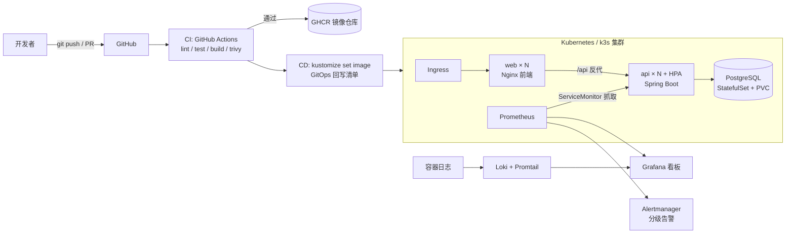

# 架构设计说明

## 总体拓扑（Mermaid 源码版，GitHub 自动渲染）



> 精美版架构图：[architecture.svg](../images/architecture.svg)（源文件）/ [architecture.png](../images/architecture.png)（高清位图）

## 全局拓扑速览

```
                ┌────────────────────────── GitHub ──────────────────────────┐
                │  PR ──► CI(lint/test/build/scan) ──► merge ──► CD(bump)    │
                └───────────────┬────────────────────────────────────────────┘
                                ▼
   用户 ──► Ingress ──► web (Nginx×N) ──/api──► api (Spring Boot×N, HPA) ──► PostgreSQL (STS)
                                              │ /metrics                    │ PVC
                                              ▼                             ▼
                                    Prometheus ──► Grafana / Alertmanager   持久化
```

## 分层设计决策

### 1. 应用层

- **为什么选 Spring Boot 3 + Java 21**：企业级生态最完整的 Java 框架（JPA/Actuator/Micrometer 开箱即用），也是简历匹配度最高的技术栈；重点在 DevOps 链路而非业务复杂度。
- **健康检查分两级**：`/healthz`（liveness，进程活着）与 `/readyz`（readiness，数据库可达，基于 `JdbcTemplate SELECT 1`）。没有数据库时 liveness 仍应通过，避免重启风暴——这是 K8s 排障的高频面试点；Actuator 的 health groups（liveness/readiness）作为底层能力同时开启。
- **`/actuator/prometheus` 使用 Micrometer**：自动输出 `http_server_requests_seconds_*` 直方图与计数器，支撑 QPS/错误率/分位延迟三类黄金指标；JVM/数据源连接池指标同时免费获得。
- **结构化 JSON 日志**：Boot 3.4 原生 `logging.structured`（logstash 格式）输出到 stdout，由 Promtail 直接采集进 Loki，无需解析规则（访谈可讲：12-Factor 日志实践）。
- **容器内 JVM 调优**：`-XX:MaxRAMPercentage=75.0` 让堆大小跟随 K8s 内存限额，而不是物理机内存——Java 容器化的必备知识点。

### 2. 容器层

- **多阶段构建**：builder 阶段装依赖到独立 venv，运行阶段只拷贝 venv + 应用代码，镜像不含 pip 缓存与构建工具。
- **非 root**：固定 uid 10001 运行；K8s 侧再叠加 `runAsNonRoot`、`drop ALL capabilities`、`seccompProfile: RuntimeDefault` 双重保险。
- **HEALTHCHECK 与 K8s 探针并存**：compose 环境由 Docker 判断健康，K8s 环境由 kubelet 判断，两套场景各自成立。

### 3. 编排层（Kustomize 与 Helm 并存的意义）

- **Kustomize base/overlays**：base 描述"应用长什么样"，overlays 描述"每个环境差异多少"（副本数、HPA 上限、命名空间）。GitOps 回写只改 overlay 的 image tag，与代码仓库解耦。
- **Helm Chart**：模板化参数（values.yaml），适合对外交付；Chart 与 Kustomize 展示两种主流打包方式，实际项目二选一即可。
- **零停机发布**：`maxUnavailable: 0` + readinessProbe 保证滚动更新时旧副本始终有存活；HPA 依赖 metrics-server，扩缩容有 `stabilizationWindowSeconds` 防抖。
- **StatefulSet + PVC**：有状态数据库的规范姿势；`serviceName` 关联 headless service 提供稳定 DNS。

### 4. 流水线层

详见 [pipeline.md](pipeline.md)。核心思想：**PR 阶段全量质量门禁（快反馈），merge 后只做构建与发布（确定性）**；发布动作不直接操作集群，而是"改 Git、让清单成为唯一事实源"。

### 5. 可观测层

- **指标**：Prometheus 抓取应用/节点/自身三类目标；告警分 `availability` 与 `resources` 两组，按 severity（critical/warning）分级路由。
- **告警抑制**：实例掉线时抑制该实例的 warning 级告警，避免告警风暴（alertmanager `inhibit_rules`）。
- **看板即代码**：Grafana 通过 provisioning 目录自动加载数据源与 JSON 看板，重建环境零手工配置。
- **日志**：Loki 存储成本低（仅索引标签不索引正文），Promtail 通过 Docker API 自动发现容器。

### 6. IaC 层

- **Terraform** 管云资源（VPC/安全组/ECS），user_data 让机器开机自带 k3s——"基础设施即代码"从虚拟机到集群一条龙。
- **Ansible** 管"机器上装什么、部署什么"，幂等（`creates:`、`changed_when:` 控制）。
- 分工原则：Terraform 管声明式云资源，Ansible 管过程性配置，二者通过 inventory/outputs 衔接。

## 安全设计清单

| 层 | 措施 |
|----|------|
| 镜像 | 多阶段构建、最小基础镜像、非 root、Trivy 扫描门禁（CRITICAL/HIGH 未修复即失败） |
| 代码 | JaCoCo 覆盖率门禁（≥ 80%）、Dependabot 自动升级 |
| K8s | securityContext、capabilities drop ALL、seccomp、资源 requests/limits 防资源抢占 |
| 密钥 | 不落盘进代码：env 注入 + Secret 对象；生产演进方向 External Secrets/Vault |

## 扩展方向（面试可讲 roadmap）

1. Secret 管理升级：External Secrets Operator + 云 KMS
2. 多集群发布：ArgoCD ApplicationSet + 金丝雀（Argo Rollouts）
3. 混沌工程：Chaos Mesh 注入故障验证告警有效性
4. 成本优化：使用 spot 实例 + Karpenter/自动伸缩节点池
